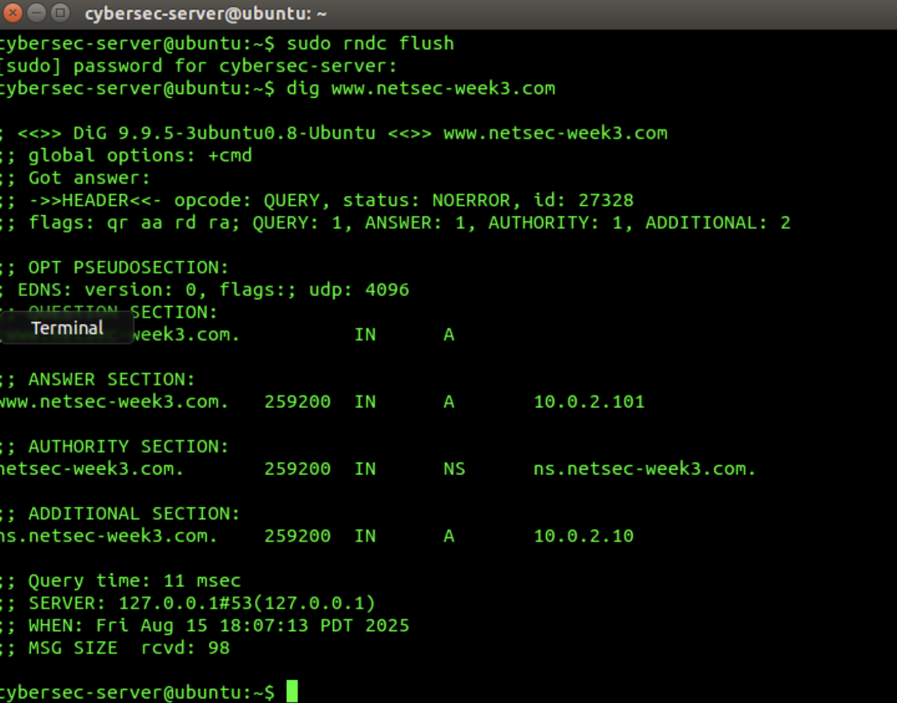
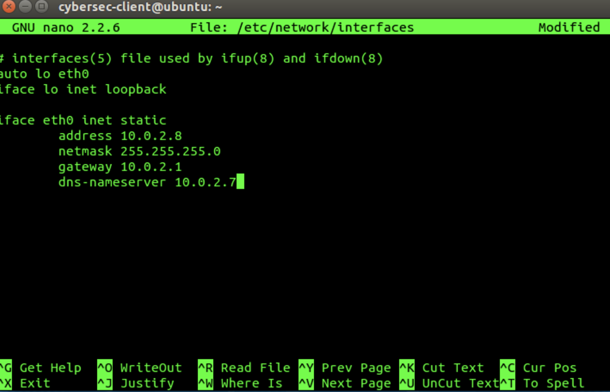
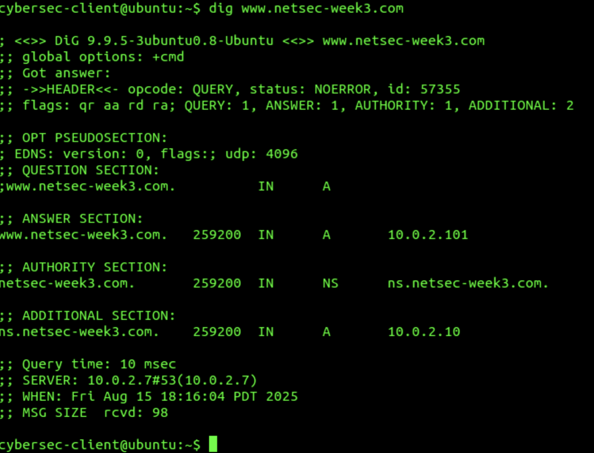

# dns-security-response-analysis

## Overview

This project documents a hands-on cybersecurity lab focused on DNS configuration, DNS packet inspection, and controlled DNS response manipulation in an isolated environment.

The lab uses tools such as `dig`, Wireshark, and Netwag to examine DNS behavior and understand the security implications of DNS responses.

## Objectives

- Obeserve baseline DNS resolution bahavior
- Modify DNS nameserver configuration
- Validate DNS changes using `dig`
- Capture and analyze DNS packets with Wireshark
- Configure and inspect controlled DNS responses
- Understand DNS-related security risks

## 1. Baseline DNS Query

Before changing the DNS configuration, I ran the `dig` command to observe the original DNS behavior.

### Analysis

This output provides a baseline for comparison before modifying the configured DNS resolver.

## 2. DNS Nameserver Configuration

The DNS nameserver setting was modified in the network interface configuration file.

### Analysis

This configuration change determines which DNS resolver the client uses when sending DNS queries.

## 3. DNS Query After Configuration Change

After modifying the DNS nameserver configuration, I ran the `dig` command again to observe the updated DNS behavior.

### Analysis

The result was used to verify that the DNS configuration change had taken effect and that the client was using the configured resolver.
