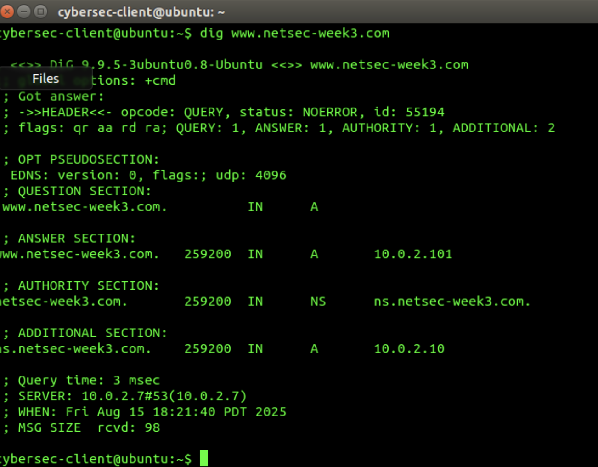
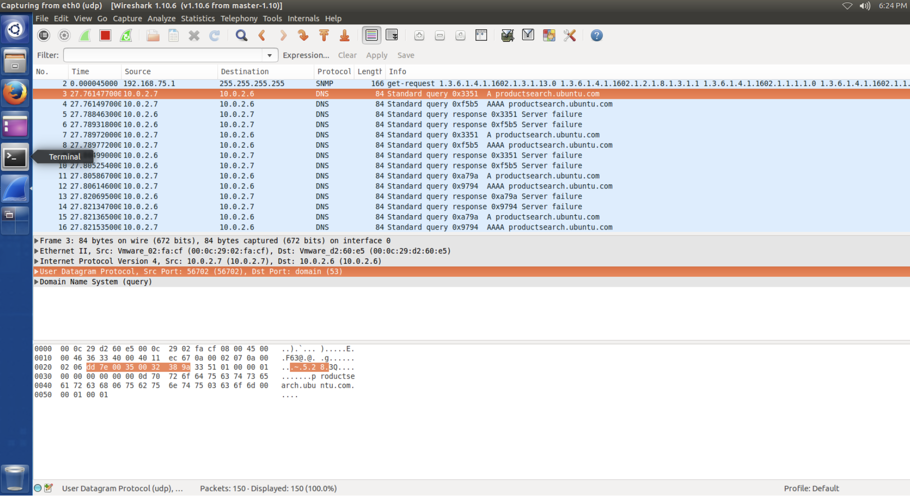
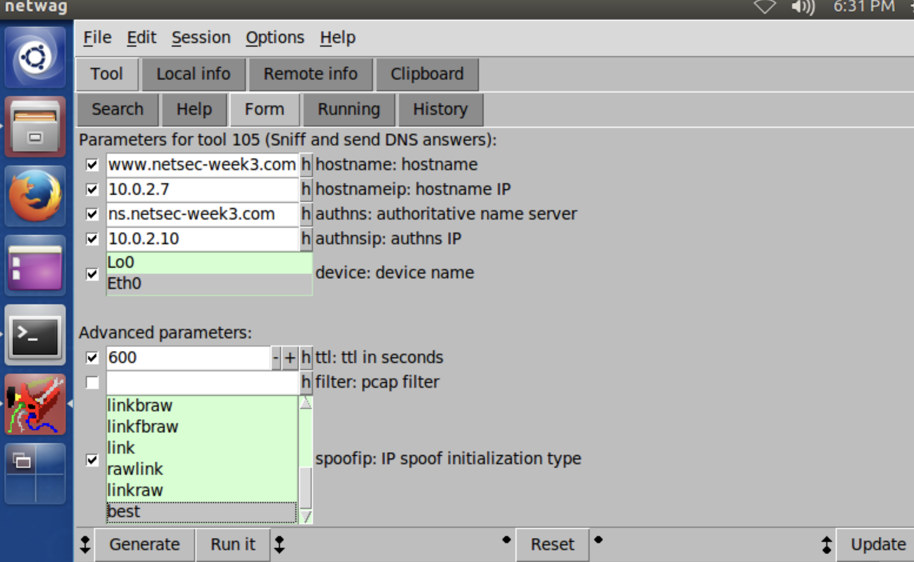
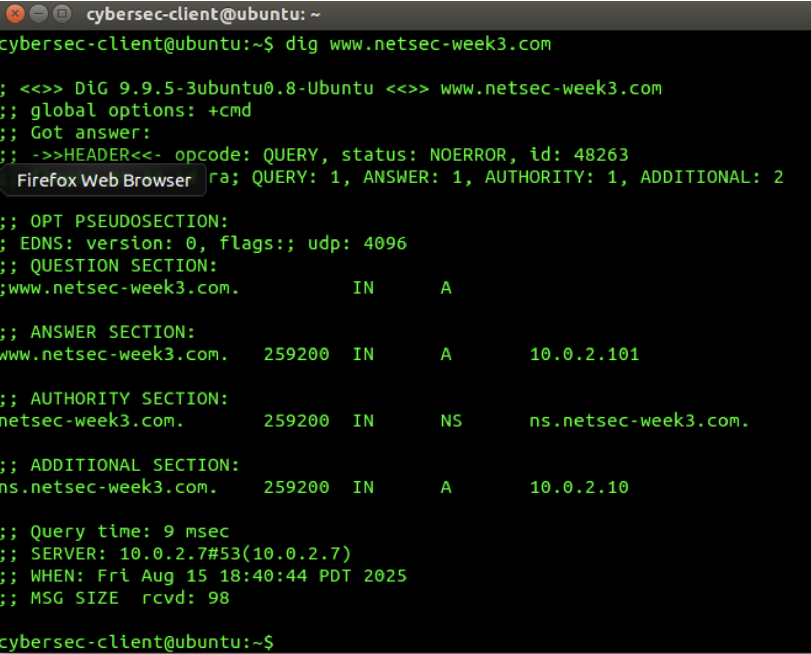
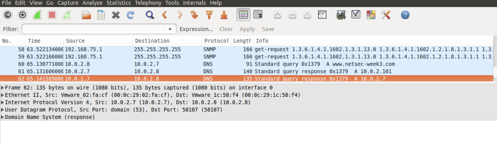
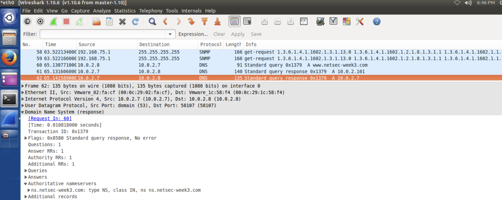
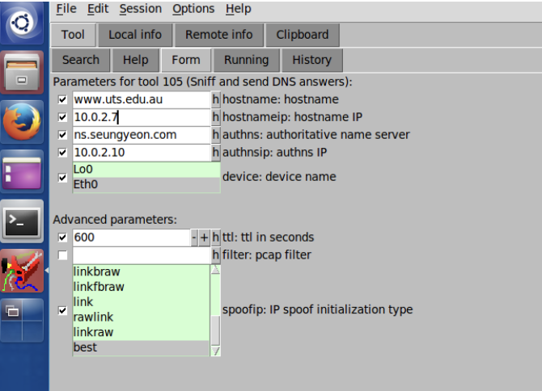
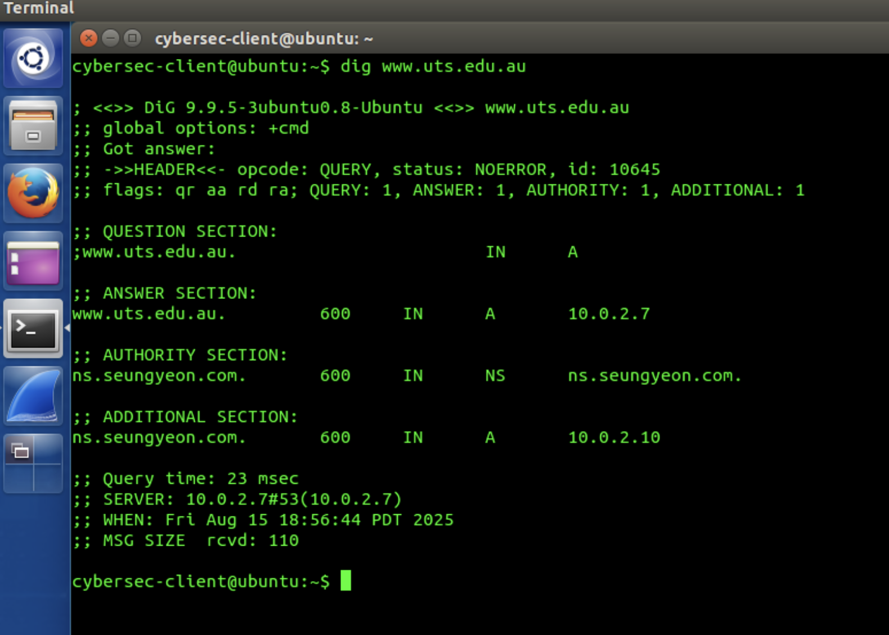

# dns-security-response-analysis

## Overview

This project documents a hands-on cybersecurity lab focused on DNS configuration, DNS packet inspection, and controlled DNS response manipulation in an isolated environment.

The lab uses tools such as `dig`, Wireshark, and Netwag to examine DNS behavior and understand the security implications of DNS responses.

## Objectives

- Obeserve baseline DNS resolution bahavior
- Modify DNS nameserver configuration
- Validate DNS changes using `dig`
- Capture and analyze DNS packets with Wireshark
- Configure and inspect controlled DNS responses
- Understand DNS-related security risks

## 1. Baseline DNS Query

Before changing the DNS configuration, I ran the `dig` command to observe the original DNS behavior.

### Analysis

This output provides a baseline for comparison before modifying the configured DNS resolver.

## 2. DNS Nameserver Configuration

The DNS nameserver setting was modified in the network interface configuration file.

### Analysis

This configuration change determines which DNS resolver the client uses when sending DNS queries.

## 3. DNS Query After Configuration Change

After modifying the DNS nameserver configuration, I ran the `dig` command again to observe the updated DNS behavior.

### Analysis

The result was used to verify that the DNS configuration change had taken effect and that the client was using the configured resolver.

## 4. Client DNS Query

A DNS query was generated from the Client VM using the `dig` command.

### Analysis

This query generated DNS traffic that could then be captured and examined using Wireshark.

## 5. DNS Packet Analysis with Wireshark

The DNS packets generated by the client were captured and filtered in Wireshark.

### Analysis

Wireshark allows DNS traffic to be inspected at the packet level. This makes it possible to examine the relationship between the DNS query and the corresponding response.
Packet analysis is useful for both troubleshooting and security monitoring because unusual DNS activity can indicate configuration problems or suspicious network behavior.

## 6. Controlled DNS Response Configuration

Netwag Tool 105 was used to configure a controlled DNS response inside the lab environment.

### Analysis

The response was configured using information gathered from the DNS query.

This exercise demonstrates how DNS response behavior can be recreated and studied in a controlled environment for educational and security-analysis purposes.

## 7. Repeating the DNS Query

The DNS query was repeated from the Client VM after configuring the response.

### Analysis 

Repeating the query made it possible to observe how the configured DNS response affected the result received by the client.

## 8. DNS Response Captured in Wireshark

The resulting DNS response was captured and examined in Wireshark.

### Analysis 

The packet capture provides evidence of the DNS response being transmitted across the lab network.

By examining the traffic in Wireshark, the response can be compared with the original DNS query.

## 9. DNS Packet Details

The detailed information section of the DNS packet was inspected in Wireshark.

### Analysis

Inspecting the packet details provides greater visibility into the structure of the DNS response and the information contained within the packet.
This type of packet-level analysis is useful when investigating abnormal or unexpected DNS behavior.

## 10. Custom DNS Response Configuration

Netwag Tool 105 was configured with the DNS response values required for the final stage of the lab.

### Analysis

This configuration was used to generate a DNS response containing specific DNS record sections that could later be validated from the client.

## 11. Final DNS Response Validation

The `dig` command was used to inspect the final DNS response.

### Analysis 

The terminal output confirmed that the DNS response contained the expected Question, Authority, and Additional sections.

This final step demonstrated that the DNS response configured in Netwag was successfully reflected in the output observed by the client.
